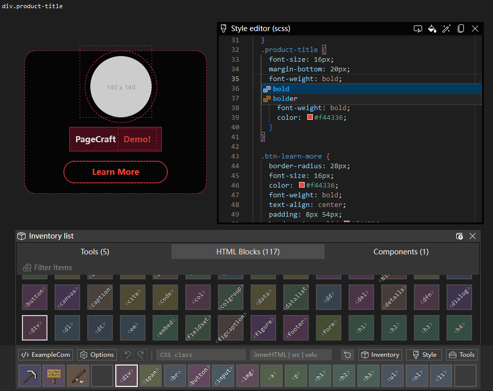

# PageCraft

网页快速生成工具，通过这个工具你可以快速创建页面的div结构，配合浏览器的控制台修改样式，然后复制到项目中。

## Tips

- 请勿做类似 `<h1>TestH1<h2>TestH2</h2></h1>` 这样的嵌套，虽然在编辑器中可以插入，但是这样不符合 HTML 规范，导入后也无法复原。

## 推荐配合插件

- Chrome DevTools
- [Web Developer](https://chrome.google.com/webstore/detail/web-developer/bfbameneiokkgbdmiekhjnmfkcnldhhm/related?utm_source=chrome-ntp-icon)
- [Live editor for CSS, Less & Sass - Magic CSS](https://chrome.google.com/webstore/detail/live-editor-for-css-less/ifhikkcafabcgolfjegfcgloomalapol/related?utm_source=chrome-ntp-icon)
